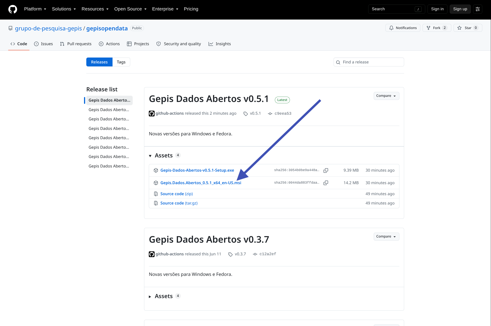

#+Title: Apresentação da Ferramenta Gepis Dados Abertos

Objetivando apoiar a cultura e reúso de dados abertos, o grupo de pesquisa GEPIS apresenta sua ferramenta de exploração e reúso de dados abertos.

A ferramenta foi está sendo desenvolvida com ajuda do Gemini e do Claude, é de código livre (licença GNU) e está hospedada em https://github.com/grupo-de-pesquisa-gepis/gepisopendata

A apresentação será totalmente de forma prática e conceitos ou informações específicas são apresentadas oportunamente nos diversos momentos da prática.

* Instalação
** Fazendo do download
   + entrar no [[https://github.com/grupo-de-pesquisa-gepis/gepisopendata/releases][link de releases ]]
   + baixar a última versão
     
     
     
* Configuração
 
* Obtendo os microdados

* Aspectos Técnicos

